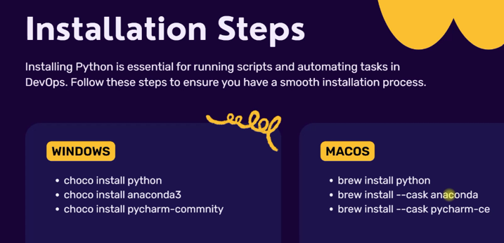

* Python for DevOps
    - basics of Python
    - how to use Python for automation.

    > For DevOps, there are many automation tools like Jenkins, Terraform, Ansible, Argo CD, etc. all these automation
    tools derives programming concepts or logic to give a sophisticated automation platform.Some tasks cannot be automated by automation tools and need some customized solutions using Python.

### Installation

* For linux or MacOs -- it comes by default but in windows it needs to be installed.


* Windows -- open PowerShell as administrator and run the commands (install chocolatey, if not installed already)
```
choco install python -y
```
```
choco install anaconda3 -y
```
```
choco install pycharm-community -y
```
> after completing installation, reboot the pc. Search for and open `Anaconda Navigator` app from start menu --> launch `jupiter` notebook (browser based python interpretor) for practicing basic commands

* Open `Anaconda Navigator` app from start menu --> launch `PyCharm Community` (IDE to run the python file in a virtual environment)

* In Linux, to create a python file use vi/vim editor and give .py extension to the file. In the file need to provide the interpretor path (same as for bash script #!/bin/bash) --> #!/usr/bin/python (default version of python)
    - In CentOS --> defualt is python 2.x (if python3 is installed then the interpretor would be #!/usr/bin/python3)
        > python2 --> print statements do not have paranthesis, eg: `print "Hello world"`.
        
        > python3 --> print statements has paranthesis, eg: `print("Hello world")`.
    - In Ubuntu 16 or higher --> default is python 3